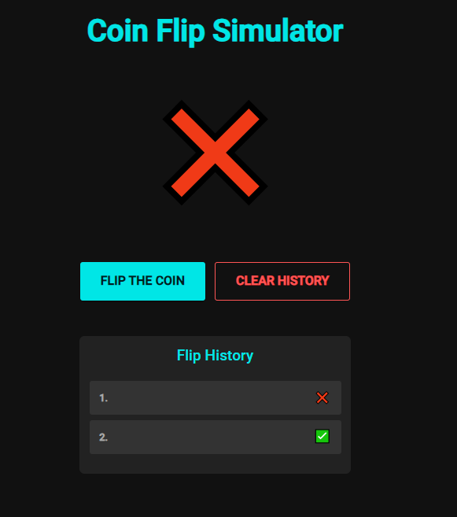

# Coin Flip Simulator 🎲💥

This is **Coin Flip Simulator**. You can flip a coin and get **heads (✅)** or **tails (❌)**, and you can see the **history** of flips. You can **clear** the history anytime. Let's have fun! 🎉


## Features 🚀

- **Flip the Coin** — Get the result after 3 coin flips.
- **History** — See your past flips with **✅** and **❌**.
- **Clear History** — Delete the history anytime. 😉

---

## 🔗 Live Demo

👉 **[https://antot-12.github.io/Coin-Flip-Simulator/](https://antot-12.github.io/Coin-Flip-Simulator/)**

---


## Screenshots 📸

Here is how the app looks! 👇



This is the dark theme with **neon blue** and **red** for a cool look. ✨

## Technology used ⚙️

- **React** — for building the app.
- **Material UI** — for the awesome design.
- **Tailwind CSS** — for styling.
- **JavaScript (JS)** — for making the coin flip logic.

## How to run the app 🚀

1. Clone this repository 🛸
   ```bash
   git clone https://github.com/Antot-12/Coin-Flip-Simulator.git
   ```

2. Install the dependencies 🧰
   ```bash
   npm install
   ```

3. Run the app 🌍
   ```bash
   npm start
   ```
   
<br>

Now go to `http://localhost:5173/` and enjoy the app! 💻✨

## 
